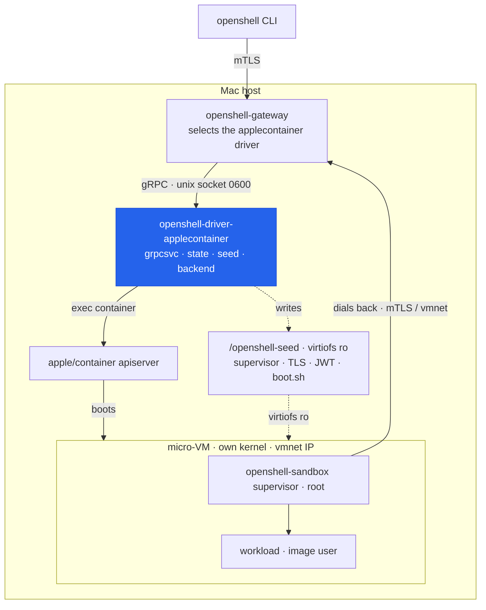

# openshell-driver-applecontainer

An out-of-tree extension compute driver for [NVIDIA OpenShell](https://github.com/NVIDIA/OpenShell)
backed by [apple/container](https://github.com/apple/container): every OpenShell sandbox is its
own micro-VM with a dedicated Linux kernel on Apple silicon. Measured here: **mean 1.1 s from
`sandbox create` to phase `Ready`** (10-cycle soak, no leaks).

<!-- TODO when public: CI badge, release badge
[](…)
-->

## Get started

One line — it checks prerequisites (Apple silicon macOS, Homebrew, apple/container, OpenShell),
offers to install anything missing, then downloads the driver (verifying its checksum) and runs
`setup`:

```sh
curl -LsSf https://raw.githubusercontent.com/vyncint/openshell-driver-applecontainer/main/install.sh | sh
```

> This URL and the release downloads it fetches work once the repository is public. While it is
> private, use the manual path below.

Then use OpenShell normally:

```sh
openshell sandbox create --name demo
openshell sandbox exec -n demo -- uname -a     # runs inside the micro-VM
openshell sandbox delete demo
```

Both services start at login and restart on failure — nothing to launch by hand, ever.
`setup` is **idempotent**: re-run it any time (after an upgrade, after changing flags, or just
to repair the installation). To upgrade or remove the stack later, see
[Update and remove](#update-and-remove).

The installer is non-interactive with `-y`, and takes `--no-setup`, `--version vX.Y.Z`,
`--openshell-version X.Y.Z`, `--container-version X.Y.Z`, and `--prefix <dir>` (or the
`OSHL_AC_YES`, `OSHL_AC_VERSION`, `OSHL_AC_OPENSHELL_VERSION`, `OSHL_AC_CONTAINER_VERSION`,
`OSHL_AC_PREFIX` env vars). Without the pins each component resolves to its latest release.

### Update and remove

Two commands manage the stack's lifecycle, mirroring apple/container's own
`update-container.sh` / `uninstall-container.sh`:

```sh
openshell-driver-applecontainer update            # update the driver to the latest release, then re-setup
openshell-driver-applecontainer update --all      # also update OpenShell (brew) and apple/container
openshell-driver-applecontainer update --version vX.Y.Z   # pin a specific driver release
openshell-driver-applecontainer update --all --openshell-version 0.0.97 --container-version 1.2.0
                                                  # pin the prerequisites too (reproducible / rollback)

openshell-driver-applecontainer cleanup           # remove the driver service + gateway wiring (data kept)
openshell-driver-applecontainer cleanup -d        # also remove driver state, vmnet network and pulled images
openshell-driver-applecontainer cleanup --all -d  # full teardown: also remove OpenShell and apple/container
```

`update` downloads the release, verifies its checksum, replaces the binary in place, and re-runs
`setup` so the service restarts on it (`--no-setup` skips that). `cleanup` layers like the
apple/container uninstaller: the bare command touches only the driver; `-d`/`--delete-data` also
removes its data (`-k`/`--keep-data` is the default); `--all` also removes the prerequisites
(apple/container's uninstaller needs `sudo`). `uninstall` remains as an alias for `cleanup`.

### Manual install

Prerequisites: an Apple-silicon Mac (macOS 26+), [apple/container](https://github.com/apple/container)
1.2+, and [OpenShell](https://github.com/NVIDIA/OpenShell)
(`curl -LsSf https://raw.githubusercontent.com/NVIDIA/OpenShell/main/install.sh | sh`). Then:

```sh
make install                              # or drop the release binary into /opt/homebrew/bin
openshell-driver-applecontainer setup
```

### What `setup` does

One command wires the whole stack permanently:

1. Starts the apple/container runtime if it is down, and creates the dedicated vmnet network
   (`oshl`) if it does not exist.
2. Reads the network's host-side gateway address (e.g. `192.168.65.1`) — the address guest VMs
   dial to reach the OpenShell gateway.
3. Ensures the gateway's server certificate carries a SAN for that address (regenerates via
   `openshell-gateway generate-certs`; the CA is preserved, so existing client bundles keep
   working). Skipped when the SAN is already present.
4. Writes `~/.config/openshell/gateway.env` — the hook the **stock Homebrew OpenShell
   service** sources at startup — so the standard `brew services` gateway selects this driver,
   listens beyond loopback, and accepts mTLS-authenticated local clients.
5. Repairs a CLI gateway registration pointing at `https://[::1]:…` (unreachable with an IPv4
   bind; older installers wrote it).
6. Installs the driver as a launchd service (`local.openshell-driver-applecontainer`,
   log at `~/Library/Logs/openshell-driver-applecontainer.log`) and restarts the gateway
   service (`brew services restart openshell`).
7. Pre-pulls the sandbox and supervisor images so the first create is fast
   (skip with `setup --no-pull`).

No flags are needed for any of it: the driver derives the gateway endpoint from the vmnet
network at startup, finds the TLS bundle in the standard locations, and creates whatever is
missing.

## Why

OpenShell's managed VM driver gives every sandbox its own kernel, but its host networking layer
is Linux-only nftables, so macOS users are pointed at Docker Desktop — containers sharing one
Linux VM. apple/container natively provides the two expensive subsystems a VM-per-sandbox
driver otherwise has to build: OCI images become bootable EXT4 root disks, and every VM gets a
routable IP on a vmnet network the Mac can reach directly. This driver wires those primitives
to OpenShell's compute-driver contract, so a Mac gets true VM-per-sandbox isolation with the
stock OpenShell gateway, CLI, policy engine, and in-guest supervisor, unmodified.

The driver is a lifecycle plane only. The in-guest `openshell-sandbox` supervisor enforces
policy (seccomp, network proxy, Landlock where available) and dials back to the gateway over
mTLS; exec and connect traffic ride that connection. The driver boots VMs correctly, delivers
supervisor + TLS material + environment, manages lifecycle state, and cleans up.

## Architecture



The gateway selects the driver over a Unix socket and stays lifecycle-only: **exec and
`connect` traffic ride the in-guest supervisor's own dialed-back gateway connection, so the
driver has no data plane.**

Per sandbox, the driver: persists the accepted launch record, extracts the release-matched
supervisor binary (cached by image digest), builds a read-only seed directory (supervisor,
gateway CA + shared client cert/key, per-sandbox JWT, boot shim), then boots
`container run -d --uid 0 --cap-add …` with the seed mounted at `/openshell-seed` and the
boot shim as entrypoint. Progress and state flow to the gateway through the `WatchSandboxes`
stream, backed by a 2 s runtime poller; the runtime — not the driver's records — is the
source of truth. See [docs/architecture.md](docs/architecture.md).

## Troubleshooting

| Symptom | Do this |
|---|---|
| anything looks broken | re-run `openshell-driver-applecontainer setup` — it repairs all wiring |
| `openshell status` fails | `brew services info openshell`; gateway log: `/opt/homebrew/var/log/openshell/openshell-gateway.err.log` |
| sandbox stuck / failed | driver log: `~/Library/Logs/openshell-driver-applecontainer.log`; failed sandboxes carry the guest console tail in their status |
| `default kernel not configured for architecture` | apple/container has no guest kernel (a fresh install, or one whose data was deleted). `setup` installs one automatically; if its download failed, retry `container system kernel set --recommended` |
| slow first create | the base image (~2.6 GB) is pulling; `setup` without `--no-pull` pre-pulls it |

## Configuration reference

Everything has a working default; set flags only to diverge. Flags on the driver
(env fallback `OSHL_AC_<NAME>`, flag wins). When installed via `setup`, re-run `setup` after
changing anything here so the launchd service picks it up:

| Flag | Default | Purpose |
|---|---|---|
| `--socket` | `/tmp/oshl-ac/driver.sock` | gRPC unix socket (keep short: macOS sun_path limit) |
| `--state-dir` | `~/.local/state/openshell-applecontainer` | sandbox records, seed dirs, supervisor cache |
| `--network` | `oshl` | vmnet network for sandbox VMs (auto-created) |
| `--default-image` | `ghcr.io/nvidia/openshell-community/sandboxes/base:latest` | advertised via GetCapabilities |
| `--supervisor-image` | matched to the installed gateway (falls back to `…/supervisor:0.0.96`) | release-matched supervisor source |
| `--grpc-endpoint` | **auto-derived** from the vmnet network (`https://<gateway-ip>:17670`) | gateway endpoint as reachable from inside guests |
| `--guest-tls-ca/cert/key` | auto-detected (`$OPENSHELL_LOCAL_TLS_DIR`, XDG state, or the Homebrew TLS dir) | client TLS triple handed to sandboxes |
| `--namespace` | `default` | namespace reported on sandboxes |
| `--cpus` / `--memory` | `2` / `2048` (MiB) | VM sizing when the request has no resources |
| `--kernel` | (runtime default kernel) | host kernel path used for **every** sandbox VM — the fleet-wide Landlock escape hatch; per-sandbox driver config overrides it |
| `--allow-host-mounts` | `false` | permit per-sandbox `volume` mounts of host directories (see security note below) |
| `--host-mount-root` | (unset) | when set, `volume` mount sources must live under this directory |
| `--allowed-networks` | (only `--network`) | comma-separated extra vmnet networks a sandbox may select via driver config |
| `--network-policy-file` | (unset — image default policy) | host path to a `policy.yaml` that replaces the sandbox's network policy for every sandbox (see [Network policy overrides](#network-policy-overrides)) |
| `--log-level` | `info` | driver log level and sandbox default |

`setup` accepts `--network`, `--socket`, `--tls-dir`, `--default-image`, `--supervisor-image`,
and `--no-pull`.

## Per-sandbox driver config

`openshell sandbox create --driver-config-json '{"applecontainer": {…}}'`:

```json
{
  "mounts": [
    {"type": "volume", "source": "/Users/me/data", "target": "/data", "read_only": true},
    {"type": "tmpfs",  "target": "/scratch"}
  ],
  "network": "other-vmnet",
  "kernel":  "/path/to/custom/vmlinux"
}
```

- `volume` bind-mounts a host directory (apple/container has no named volumes; `source` is a
  host path). `read_only` defaults to **true**. **Volume mounts are off by default** — the
  driver rejects them unless started with `--allow-host-mounts`, and `--host-mount-root`
  constrains which host directories are permitted. `tmpfs` mounts never touch the host and
  are always allowed. See [SECURITY.md](SECURITY.md).
- Targets at or under `/opt/openshell`, `/etc/openshell`, `/etc/openshell-tls`, `/run/netns`,
  `/sandbox`, or `/openshell-seed` are rejected.
- `network` selects a vmnet network for this sandbox; it must be `--network` or one of
  `--allowed-networks`.
- `kernel` passes through to `container run --kernel` — e.g. a kernel built with Landlock
  enabled (see limitations).
- Unknown keys are rejected.

Resource requests (`openshell sandbox create --cpu 3 --memory 3Gi`) map to **real VM sizing**
(`--cpus` / `--memory`), unlike the upstream VM driver, which accepts but ignores them.
Limits win over requests; Kubernetes quantity strings are accepted; apple/container adds one
`cpuOverhead` vCPU on top of the request.

## Network policy overrides

Every sandbox image ships a default network policy at `/etc/openshell/policy.yaml` — a
per-binary, per-destination allowlist (not a simple domain block) that the in-guest supervisor
enforces on every outbound connection. It's deliberately tight: for example, the default
`claude_code` policy lets the `claude` binary reach `api.anthropic.com` but **not**
`downloads.claude.ai`, so `claude update` fails inside a sandbox with a `403` from the policy
proxy — that's the sandbox working as designed, not a bug.

If you need a sandbox to reach additional hosts (a tool's self-updater, an internal registry,
etc.), start `openshell-driver-applecontainer` with:

```sh
--network-policy-file /path/to/policy.yaml
```

The driver installs that file over `/etc/openshell/policy.yaml` at boot — as root, before the
supervisor starts, which is the only point at which that file is writable (the shipped policy
marks `/etc` read-only for the running workload). **Start from the image's shipped policy and
add entries**; don't write one from scratch:

```sh
openshell sandbox exec -n <any-sandbox> -- cat /etc/openshell/policy.yaml > my-policy.yaml
# edit my-policy.yaml — e.g. add { host: downloads.claude.ai, port: 443 } under claude_code
openshell-driver-applecontainer --network-policy-file "$(pwd)/my-policy.yaml"
```

This is a **driver-wide, operator-only** control — there is no per-sandbox equivalent, and it
cannot be set through `--driver-config-json`, because it changes the guest's own security
policy for every sandbox this driver instance boots, not just this driver's own behavior. See
[SECURITY.md](SECURITY.md) for the trust model.

## Manual operation (development)

The services are optional — for development, run each piece by hand:

```sh
make build
bin/openshell-driver-applecontainer            # zero flags: network + endpoint auto-derived

# gateway with the same settings the service would use:
OPENSHELL_LOCAL_TLS_DIR=/opt/homebrew/var/openshell/tls \
openshell-gateway --bind-address 0.0.0.0 --enable-mtls-auth true \
  --drivers applecontainer --compute-driver-socket /tmp/oshl-ac/driver.sock
```

Notes for manual runs: the gateway's socket dial is fail-fast, so start the driver first;
`--enable-mtls-auth true` is required for extension drivers (the default covers only
docker/podman/vm); the gateway TOML equivalent is
`[openshell.gateway] compute_drivers = ["applecontainer"]` +
`[openshell.drivers.applecontainer] socket_path = "…"` (extension driver tables carry ONLY
`socket_path`).

```sh
make test    # go test -race ./...
make lint    # golangci-lint run
make e2e     # live smoke: create -> Ready -> exec -> policy block -> delete
make soak    # 10x lifecycle cycles with mean create->Ready latency
```

Unit tests run everywhere; `e2e`/`soak` require this Mac-shaped environment (see
`.github/workflows/e2e.yml` — hosted CI never runs them). Real transcripts of every live
acceptance live in `docs/acceptance.md`; environment probes in `docs/gate0.md`; the contract
recon in `docs/CONTRACT.md`.

## Limitations

- **Landlock is absent from the default guest kernel** (kata-static 6.18.x:
  `CONFIG_SECURITY_LANDLOCK is not set`), so OpenShell filesystem policy degrades to
  `best_effort` (an alert is emitted in-guest; seccomp and the network policy proxy are
  unaffected). Escape hatch: a Landlock-enabled kernel build, either fleet-wide via the
  driver's `--kernel` flag or per sandbox via the driver-config `kernel` field.
- **No host-side nftables defense layer** — that upstream mechanism is Linux-only. On macOS,
  vmnet NAT already blocks inbound traffic from off the Mac; a pf anchor reproducing the
  "guests may only reach the gateway port" rule is possible future work.
- `StopSandbox` returns `Unimplemented` (the gateway never calls it in v0.0.96; the managed
  VM driver does the same).
- GPU sandboxes are rejected (`ValidateSandboxCreate` fails them explicitly).
- One `cpuOverhead` vCPU is added by apple/container on top of the requested count.

## Compatibility

| driver | OpenShell | apple/container | host |
|---|---|---|---|
| v0.1.x – v0.2.x | contract derived from v0.0.96 (`5541398ccbda`); verified against 0.0.96 and 0.0.97 | 1.2.0 | Apple silicon, macOS 26 |

The supervisor runs **inside** every sandbox and speaks to the gateway, so its image tag must
track the gateway's version. The driver reads the installed gateway's version
(`openshell-gateway --version`) and pulls the matching `supervisor:<version>` automatically —
`setup` prints the resolved driver / gateway / apple-container versions and warns on a mismatch.
Pin it yourself with `--supervisor-image` (or `OSHL_AC_SUPERVISOR_IMAGE`) to opt out; if the
matching tag is unpublished the driver falls back to the pinned one rather than failing.

Pin the whole stack for a reproducible install (or to roll back a bad upstream release):

```sh
curl -LsSf …/install.sh | sh -s -- --version v0.2.6 --openshell-version 0.0.97 --container-version 1.2.0
openshell-driver-applecontainer update --all --openshell-version 0.0.97 --container-version 1.2.0
```

## Install from a release (manual)

The one-line installer above does this for you. To do it by hand: download the `darwin_arm64`
archive from a [release](https://github.com/vyncint/openshell-driver-applecontainer/releases),
verify its checksum against `checksums.txt`, unpack into `/opt/homebrew/bin`, clear the
quarantine bit (unsigned binary), then run `setup`:

```sh
shasum -a 256 -c checksums.txt --ignore-missing
tar -xzf openshell-driver-applecontainer_*_darwin_arm64.tar.gz
install -m 0755 openshell-driver-applecontainer /opt/homebrew/bin/
xattr -d com.apple.quarantine /opt/homebrew/bin/openshell-driver-applecontainer
openshell-driver-applecontainer setup
```

<!-- TODO when public: enable the Homebrew tap section in .goreleaser.yaml and document
     `brew install` here (a private tap is useless). -->
<!-- Future: sign releases (cosign) so the installer can verify authenticity, not just
     integrity. -->

## Contributing

See [CONTRIBUTING.md](CONTRIBUTING.md) for the build/test workflow, commit conventions, and
the required DCO sign-off; [MAINTAINERS.md](MAINTAINERS.md) for who reviews and merges; and
the [Code of Conduct](CODE_OF_CONDUCT.md). Report vulnerabilities privately per
[SECURITY.md](SECURITY.md).

## License

Apache-2.0. See [LICENSE](LICENSE) and [NOTICE](NOTICE) (vendored proto attribution).
