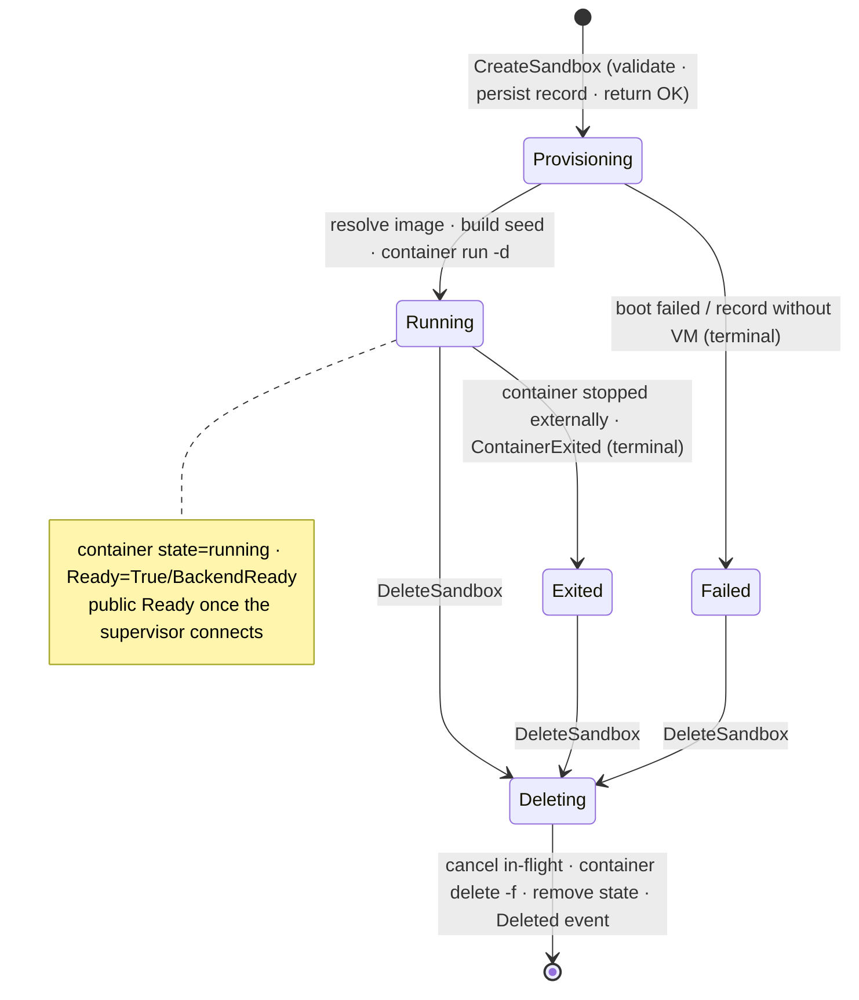

# OpenShell compute-driver contract notes

Everything below was derived by reading NVIDIA/OpenShell at tag **v0.0.96**
(commit `5541398ccbda05fd951e08e5741b9ca090717f3a`). File:line references are into that tree.
The two contract protos are vendored verbatim under `proto/` (see NOTICE).

## 1. RPC surface (proto/compute_driver.proto, package openshell.compute.v1)

Eight RPCs — well under this project's ~15-RPC kill criterion, and stable at this tag:

| RPC | Notes |
|---|---|
| `GetCapabilities` | Handshake. First call the gateway makes after dialing the socket. Returns driver name/version and `default_image`. |
| `ValidateSandboxCreate` | Called by the gateway **before** every create (grpc/sandbox.rs:257). Cheap validation only. |
| `GetSandbox` | Point read; used by reconcile/delete recovery, not polled after create. |
| `ListSandboxes` | Called every 60 s by the gateway reconcile loop (compute/mod.rs:264-265). |
| `CreateSandbox` | Returns an **empty response**; accept-then-provision. Progress flows via WatchSandboxes. |
| `StopSandbox` | **Never called by the gateway in v0.0.96** (no lifecycle callsite; verified full-tree). The managed VM driver returns `Unimplemented`, and so do we (there is no caller to exercise a real implementation against). |
| `DeleteSandbox` | Must return `deleted=true` iff a platform resource was removed; gateway branches on it (compute/mod.rs:906-923). |
| `WatchSandboxes` | Server stream. Gateway reconnects on a **fixed 2 s** cadence after stream end/error (compute/mod.rs:1642,1675). Replay a full snapshot on stream open, then stream diffs. |

## 2. Gateway ↔ extension-driver mechanics

- Selection: `[openshell.gateway] compute_drivers = ["applecontainer"]` plus
  `[openshell.drivers.applecontainer] socket_path = "…"`. The drivers table for an extension
  driver deserializes into exactly `{ socket_path }` (compute/driver_config.rs:108-113) —
  **no other keys are read or inherited**, so all real driver configuration must come from the
  driver's own flags/env.
- Launch-time override: `openshell-gateway --drivers applecontainer
  --compute-driver-socket /tmp/oshl-ac/driver.sock` (cli.rs:97-122). The socket flag requires
  exactly one non-reserved driver name.
- Reserved names: `kubernetes | vm | docker | podman` (core/config.rs:85-145).
- Routing and `driver_config` block selection use the **config key** (`applecontainer`), not
  `GetCapabilities.driver_name` (compute/mod.rs:672,696,2371-2387).
- Dial is **eager and fail-fast**: if the socket is absent at gateway startup, the gateway
  exits — no retry (compute/mod.rs:2283-2302). The driver must be running first.
- No gRPC health protocol is used against drivers; `GetCapabilities` is the de-facto probe.
- The gateway never spawns or supervises extension drivers.
- Gateway store reconcile prunes rows absent from the backend after a 300 s orphan grace
  period (compute/mod.rs:268-269,2166-2234), so a driver that loses a VM will see the gateway
  clean up within ~6 min even without watch events.

## 3. CreateSandbox call flow (gateway side)

1. Public API create → validation → image default: empty `template.image` is replaced with
   **our** `GetCapabilities.default_image` (grpc/sandbox.rs:214-218).
2. `id` = random UUIDv4; `name` = user-supplied or generated (grpc/sandbox.rs:229-234).
3. `ValidateSandboxCreate(sandbox)` → any error aborts the create.
4. Gateway mints a per-sandbox JWT and sets `spec.sandbox_token` (grpc/sandbox.rs:271-284,
   compute/mod.rs:737-741). Marked `(openshell.options.v1.secret)` — must never be logged.
5. `CreateSandbox(sandbox)` — no RPC timeout is applied by the gateway. On error the store row
   is rolled back; on success the gateway returns immediately (public phase `Provisioning`)
   and waits for watch events / reconcile. It does **not** poll GetSandbox after create.
6. `namespace` arrives **empty by design** — "set by the driver based on its config"
   (compute/mod.rs:2321). `spec.environment` and `template.environment/labels` are copied
   verbatim from the user; the gateway injects nothing into them.

## 4. Phase derivation — what our conditions must look like

`derive_phase` (compute/mod.rs:2834-2859): first condition with `type == "Ready"` (exact,
case-sensitive) decides. `status == "True"` (case-insensitive) → Ready; `"False"` → **Error**
unless the reason is in the transient set; anything else / no Ready condition → Provisioning.
`deleting=true` wins over everything → Deleting.

Transient (non-terminal) reasons, compared lowercased (compute/mod.rs:2897-2910):
`reconcilererror, dependenciesnotready, supervisornotconnected, starting, containerstarting,
containercreated, healthcheckstarting, inspectfailed`. **Any other reason on Ready=False is a
terminal Error.**

On top of that, the gateway overlays supervisor-session state (compute/mod.rs:2723-2776):
backend `Ready=True` without a connected supervisor session is demoted to public
`Provisioning` with a synthetic `SupervisorNotConnected` condition; the public phase becomes
`Ready` only when the in-guest supervisor's `ConnectSupervisor` stream is up. Readiness
therefore does not depend on `instance_id`: the supervisor self-identifies with
`hello.sandbox_id` (supervisor_session.rs:664-698). `instance_id` is observability only in
v0.0.96 (`sandbox_id_for_agent_pod` has zero callers).

Condition vocabulary this driver emits (all `type="Ready"`):

| When | status | reason |
|---|---|---|
| accepted / provisioning | False | `Starting` |
| container `running` | True | `BackendReady` |
| container stopped/exited | False | `ContainerExited` (terminal) |
| provisioning failed | False | `ProvisioningFailed` (terminal) |
| deleting | False | `Deleting` + `deleting=true` |

## 5. What the driver must materialize (env / TLS / token)

None of this crosses the proto; it is the driver's job (verified: the gateway hands extension
drivers only `socket_path`). Canonical env names from core/sandbox_env.rs:

- Required by the supervisor: `OPENSHELL_SANDBOX_ID`, `OPENSHELL_ENDPOINT`; with an `https://`
  endpoint also `OPENSHELL_TLS_CA/CERT/KEY` (each hard-required, grpc_client.rs:147-158); and
  a token source — we use `OPENSHELL_SANDBOX_TOKEN_FILE` (never the raw token in env).
- Also set (parity with the docker/vm drivers): `OPENSHELL_SANDBOX` (name),
  `OPENSHELL_SSH_SOCKET_PATH=/run/openshell/ssh.sock`, `OPENSHELL_SANDBOX_COMMAND=sleep
  infinity`, `OPENSHELL_LOG_LEVEL`, `OPENSHELL_TELEMETRY_ENABLED`,
  `OPENSHELL_OCI_IMAGE_USER=<image USER>` (so the supervisor drops the workload to the image's
  user), `OPENSHELL_USER_ENVIRONMENT=<json of user env>` (when non-empty), `HOME=/root`,
  `PATH=…`, `TERM=xterm`. User env (template then spec, spec wins) is applied first;
  driver-owned keys win last. `template.agent_socket_path`, when set, overrides the SSH socket
  path value.
- TLS material: the gateway's **shared client triple** (per-sandbox identity is the JWT, not
  the cert). Source on this machine: the gateway TLS state dir (`ca.crt`, `client/tls.crt`,
  `client/tls.key`; server/defaults.rs:19-38). Homebrew installs generate it via
  `openshell-gateway generate-certs`.
- `OPENSHELL_ENDPOINT` must be reachable **from inside the guest VM**: for apple/container
  that is `https://<vmnet gateway ip>:17670` (e.g. 192.168.65.1). Two host-side requirements:
  gateway `bind_address` must not be loopback-only, and the server cert must carry a SAN for
  the address the guest dials (`--server-sans` / `server_sans` config, cli.rs:196-203).
- Delivery mechanism in this driver: one read-only **seed volume** per sandbox at
  `/openshell-seed` containing supervisor binary, `tls/{ca.crt,tls.crt,tls.key}`,
  `auth/sandbox.jwt` (0600 on host), and `boot.sh`. Env TLS/token paths point into the seed
  mount. `boot.sh` copies the supervisor to a writable path, `chmod +x`, `exec`s it — this
  sidesteps `container cp`'s exec-bit loss and any future noexec mount semantics.

## 6. Supervisor boot expectations (for image / caps decisions)

- The supervisor (`openshell-sandbox`, static musl, one binary) runs as **root** and does not
  drop privileges itself; the workload child drops to the sandbox uid/gid. It creates a
  workload netns via `ip netns add` (needs iproute2 in the image), runs an L7 CONNECT proxy,
  applies a seccomp prelude (fatal if unavailable) and Landlock best-effort (degrades with an
  alert — our G0.2 case), binds the exec/SSH unix socket at `OPENSHELL_SSH_SOCKET_PATH`, and
  opens a persistent `ConnectSupervisor` stream to the gateway.
- Exec/`sandbox connect` data-plane: relayed over that supervisor stream (RelayOpen /
  RelayStream on the same HTTP/2 connection). **The compute driver has no data plane.**
  `agent_fd`/`sandbox_fd` stay empty (docker/podman do the same).
- In an apple/container VM the supervisor has full root in its own kernel, so the
  docker-specific `--cap-add`/apparmor workarounds should be unnecessary; default caps are
  tried first (verified during M3 live work).

## 7. Images

- Default sandbox image: `ghcr.io/nvidia/openshell-community/sandboxes/base:latest`
  (core/image.rs:14-23); bare names expand to `ghcr.io/nvidia/openshell-community/sandboxes/<name>:latest`.
  The default policy (allows Claude Code endpoints, denies other egress) is baked into that
  image; a policy-forbidden probe for acceptance tests is e.g. `curl https://example.com`
  → in-guest proxy answers 403.
- Supervisor image: `ghcr.io/nvidia/openshell/supervisor:<version>` (core/config.rs:39-72);
  release-matched tag (`0.0.96` for this pin), binary at `/openshell-sandbox`
  (driver_utils.rs:47), Alpine-based, built for linux/amd64+arm64
  (.github/workflows/docker-build.yml:24). Only mutable tags (`dev`, `latest`) are
  re-pull-refreshed by upstream drivers; immutable tags are cached forever, keyed by image
  digest — we mirror that (cache key: image digest + OpenShell version pin, same
  invalidation rule as the VM driver's `…:openshell-{version}:{identity}` scheme,
  openshell-driver-vm/src/driver.rs:4354-4366).
- Podman-style digest pinning: inspect once, create with pulling disabled, run by the pinned
  identity (podman/driver.rs:568-583, container.rs:969,1067). Note both upstream local
  drivers pin the **local image ID**, not RepoDigest.

## 8. Forbidden mount targets (copied verbatim from core/driver_mounts.rs:28-33,108-126)

User-requested mounts (driver-config) may not target `/`, may not be non-absolute or
non-normalized, and may not be **at or under**:

```
/opt/openshell
/etc/openshell
/etc/openshell-tls
/run/netns
/sandbox        (special-cased alongside the reserved list)
```

This driver additionally rejects `/openshell-seed` (its supervisor/TLS/token seed mount).

## 9. Per-sandbox driver config channel

`openshell sandbox create --driver-config-json '{"applecontainer": {...}}'` → the gateway
selects the `applecontainer` block (by config key) and forwards it as
`template.driver_config` (google.protobuf.Struct). Schema accepted by this driver (M5):

```json
{
  "mounts":  [ {"type": "volume|tmpfs", ...} ],
  "network": "<vmnet network name>",
  "kernel":  "<host path passed to container run -k>"
}
```

Unknown keys are rejected (upstream drivers use deny_unknown_fields; we match).

## 10. Sandbox lifecycle state machine (driver-local)



Restart reconcile: scan records ↔ `container ls -a`; adopt running VMs (apple/container VMs
survive a driver restart — unlike libkrun children, which die with the driver); a record whose
container is missing or stopped reports a terminal condition; containers carrying our
`openshell.ai/managed-by` label without a record are orphans and are deleted.

## Unverified assumptions

- The supervisor image tag for a release build is inferred as the crate version (`0.0.96`);
  the build could override it via `OPENSHELL_IMAGE_TAG`/`IMAGE_TAG` at compile time. Verified
  empirically instead: the tag exists and pulls for linux/arm64 (docs/gate0.md G0.4).
- Whether the community `base:latest` image contains iproute2/nftables (the supervisor
  degrades gracefully without `nft`, netns/mod.rs:265-278, but netns creation needs `ip`) —
  observed during M3 live acceptance rather than proven from source.
- Default capability set of apple/container VMs is assumed sufficient for the supervisor's
  root operations (netns, tmpfs mount, chown); M3 live acceptance is the test. If it fails,
  the fallback is `--cap-add` at `container run`.
- `container run` accepting `<ref>@<digest>` image references is assumed for digest pinning;
  verified in M5 before the pinning code lands.
- Gateway behavior when `GetCapabilities` succeeds but a later `WatchSandboxes` is never
  served: reconcile-only operation is inferred from source (60 s ListSandboxes loop) but not
  exercised live.
