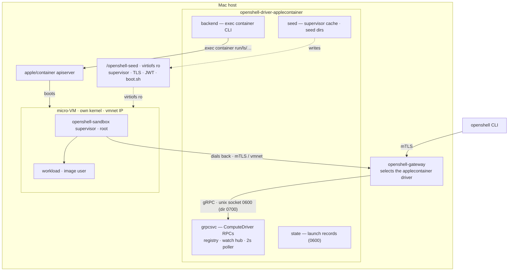
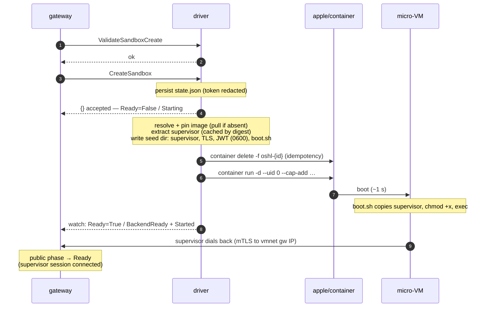
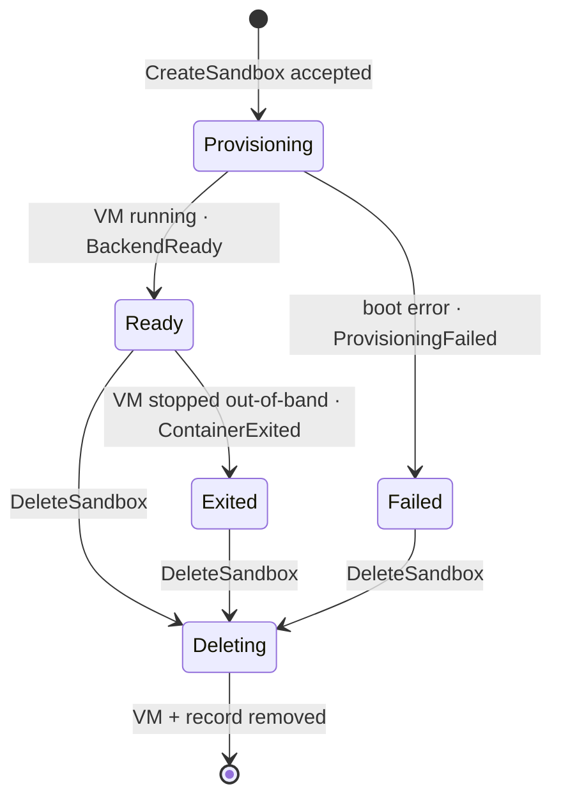
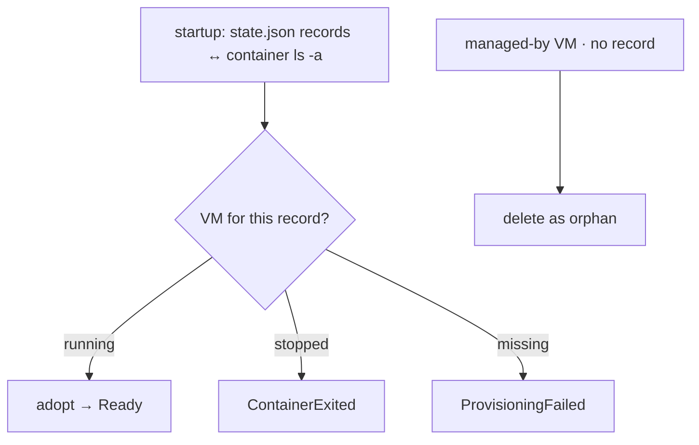

# Architecture

`openshell-driver-applecontainer` is an out-of-tree [OpenShell](https://github.com/NVIDIA/OpenShell)
compute driver whose backend is [apple/container](https://github.com/apple/container). Every
sandbox is a micro-VM with its own Linux kernel on Apple silicon. The driver is a **lifecycle
plane only**: it boots the VM and delivers the supervisor, TLS material, and per-sandbox token;
policy enforcement and exec traffic live in the guest.

## Topology

The gateway's `RemoteComputeDriver` forwards every RPC over the Unix socket
(`/tmp/oshl-ac/driver.sock`). Exec and `connect` data ride the supervisor's own dialed-back
gateway connection (`RelayOpen`/`RelayStream` on the same HTTP/2 session); the driver never
touches that path.

## Create flow

Accept-then-provision: the driver persists the launch record and returns immediately, then
boots the VM in the background. The gateway promotes the sandbox to public `Ready` only once
the in-guest supervisor connects.

Failure at any provisioning step yields `Ready=False / ProvisioningFailed` (terminal) plus a
`Warning` platform event carrying the guest console tail; the record survives for inspection
until deleted.

## Sandbox lifecycle

Driver-side conditions the gateway reads (`internal/grpcsvc/conditions.go`). A 2 s runtime
poller keeps them truthful against `apple/container`.

## Reconciliation

The runtime — not the driver's records — is the source of truth.

- **Startup** (`Bootstrap`): apple/container VMs are owned by the system apiserver and survive
  a driver restart (verified live), so a running VM is **adopted**, not relaunched. Containers
  labeled `openshell.ai/managed-by=openshell-driver-applecontainer` without a record are
  deleted as orphans.
- **Runtime poller** (2 s, docker-driver cadence): flips conditions on state changes and
  publishes watch events. In-flight provisioning is skipped and original failure reasons are
  preserved. The gateway additionally reconciles via `ListSandboxes` every 60 s and prunes
  store rows absent from the backend after a 300 s grace period.

## Security posture

- **Driver socket**: directory 0700, socket 0600, live-instance detection, stale-socket
  recovery, and a symlink/ownership check on the (shared `/tmp`) socket directory.
- **Sandbox token**: never in env or logs; written 0600 in the seed dir and redacted from
  persisted records (VMs are never relaunched from records, so the token need not be stored).
- **Seed dir** mounted read-only; every seed file is owner-only. User-requested mounts cannot
  shadow reserved paths (including the seed), host **volume** mounts are opt-in
  (`--allow-host-mounts` / `--host-mount-root`), and the network override is allowlisted.
- **Privileges**: the boot shim and supervisor run as guest root with exactly the four
  capabilities the upstream docker driver grants (`SYS_ADMIN`, `NET_ADMIN`, `SYS_PTRACE`,
  `SYSLOG`) on top of the guest init's default set; workloads drop to the image's OCI user
  (verified live: uid 998).
